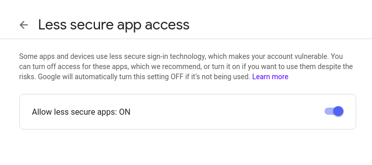

# Instructions

## Allow python to login to your G-mail

1. Go to this website: https://support.google.com/accounts/answer/6010255?hl=en
2. Click on `If "Less secure app access" is off for your account` 
3. Click on `turn it back on`
4. 

Now make sure you have all dependencies

``` bash
sudo pip3 install RPi.GPIO
sudo pip3 install smtplib
sudo pip3 install ssl
```

